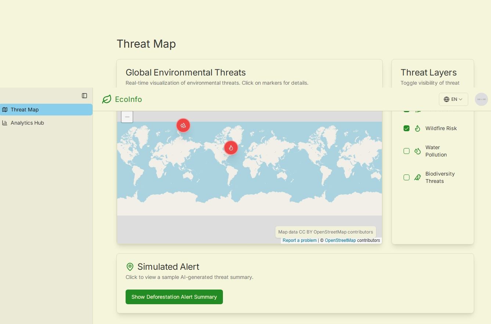

# EcoInfo - AI Environmental Guardian System

[](#)
*<p align="center" style="font-size: 0.9em; color: #666;">Replace this placeholder with an actual screenshot or banner for your project. (data-ai-hint: environmental technology dashboard app_screenshot)</p>*

EcoInfo is a comprehensive platform designed to monitor, analyze, and predict environmental threats using advanced AI and data visualization techniques. It provides real-time insights into deforestation, wildfire risks, water pollution, and biodiversity threats, empowering users to make informed decisions for environmental protection.

## Table of Contents

- [Core Features](#core-features)
- [Tech Stack](#tech-stack)
- [Style Guidelines](#style-guidelines)
- [Getting Started](#getting-started)
  - [Prerequisites](#prerequisites)
  - [Installation](#installation)
  - [Running the Development Server](#running-the-development-server)
  - [Running Genkit Flows](#running-genkit-flows)
  - [Building for Production](#building-for-production)
- [Project Structure](#project-structure)
- [Contributing](#contributing)
- [License](#license)

## Core Features

-   **Threat Map**: Display real-time environmental threat data on an interactive map (currently using Google Maps iframe).
-   **Threat Monitoring**: Visualize and monitor threat areas for:
    -   Deforestation (e.g., Sentinel-2 API insights)
    -   Wildfire risk (e.g., NASA FIRMS API insights)
    -   Water pollution (e.g., IoT sensor data insights)
    -   Biodiversity threats
-   **Analytics Hub**: Display key environmental metrics using clear, concise Chart.js visualizations powered by ShadCN UI components.
-   **AI-Powered Summaries**: Leverage Genkit to generate summaries for threat reports.
-   **Multilingual Support**: Provides UI elements for multilingual support (EN/ES/PT) - full translation implementation pending.
-   **User Authentication**: Mock login page, with potential to expand to full role-based access control.

## Tech Stack

-   **Frontend Framework**: [Next.js](https://nextjs.org/) (v15+) with App Router
-   **Language**: [TypeScript](https://www.typescriptlang.org/)
-   **UI Components**: [ShadCN UI](https://ui.shadcn.com/)
-   **Styling**: [Tailwind CSS](https://tailwindcss.com/)
-   **AI Integration**: [Genkit (Firebase Genkit)](https://firebase.google.com/docs/genkit) for AI flows and model interaction (e.g., Google AI's Gemini models).
-   **Charting**: [Recharts](https://recharts.org/) (via ShadCN UI Chart components)
-   **Icons**: [Lucide React](https://lucide.dev/)

## Style Guidelines

-   **Primary Color**: Dark forest green (`#228B22`) - Evokes nature and environmental awareness.
-   **Background Color**: Off-white (`#F5F5DC`) - Provides a clean, readable interface.
-   **Accent Color**: Sky blue (`#87CEEB`) - Highlights interactive elements and alerts.
-   **Font**: 'Inter' (sans-serif) - Modern, objective feel, suitable for data visualization.
-   **UI Design**:
    -   Aesthetically pleasing and functional components suitable for production.
    -   Rounded corners, shadows, and drop shadows for elements.
    -   Responsive layout optimized for desktop and mobile viewing.
    -   Subtle animations for enhanced user interaction (via Tailwind CSS and ShadCN components).

## Getting Started

Follow these instructions to get a copy of the project up and running on your local machine for development and testing purposes.

### Prerequisites

-   Node.js (v18 or later recommended)
-   npm or yarn

### Installation

1.  **Clone the repository:**
    ```bash
    git clone <your-repository-url>
    cd EcoInfo
    ```

2.  **Install dependencies:**
    ```bash
    npm install
    # or
    # yarn install
    ```

3.  **Set up environment variables (if any):**
    Create a `.env.local` file in the root directory by copying `.env.example` (if provided) or `.env` (if it's safe to copy).
    Fill in any necessary API keys or configuration values. For example, for Genkit with Google AI:
    ```env
    GOOGLE_API_KEY=your_google_ai_api_key_here
    ```

### Running the Development Server

To run the Next.js application in development mode:

```bash
npm run dev
# or
# yarn dev
```

Open [http://localhost:3000](http://localhost:3000) with your browser to see the result.

### Running Genkit Flows

Genkit flows are used for AI-powered features. To run the Genkit development server (which makes flows available for the Next.js app to call):

```bash
npm run genkit:dev
# or for watching changes
# npm run genkit:watch
```

This typically starts the Genkit developer UI on [http://localhost:4000](http://localhost:4000) and makes flows callable from your Next.js application.

### Building for Production

To build the application for production:

```bash
npm run build
# or
# yarn build
```

This will create an optimized build in the `.next` folder.

To run the production build locally:

```bash
npm run start
# or
# yarn start
```

## Project Structure

A brief overview of the key directories:

-   `src/app/`: Contains the Next.js App Router pages and layouts.
    -   `src/app/(dashboard)/`: Pages and layout for the main authenticated dashboard.
    -   `src/app/login/`: Login page.
-   `src/components/`: Reusable UI components.
    -   `src/components/common/`: General components like Header, Footer, Sidebar.
    -   `src/components/ui/`: ShadCN UI components.
    -   `src/components/threats/`: Components specific to threat visualization.
-   `src/ai/`: Genkit related files.
    -   `src/ai/flows/`: Definitions for Genkit flows.
    -   `src/ai/tools/`: Definitions for Genkit tools.
    -   `src/ai/genkit.ts`: Genkit initialization and configuration.
    -   `src/ai/dev.ts`: Entry point for Genkit development server.
-   `src/lib/`: Utility functions (e.g., `cn` for Tailwind class merging).
-   `src/hooks/`: Custom React hooks.
-   `public/`: Static assets.


